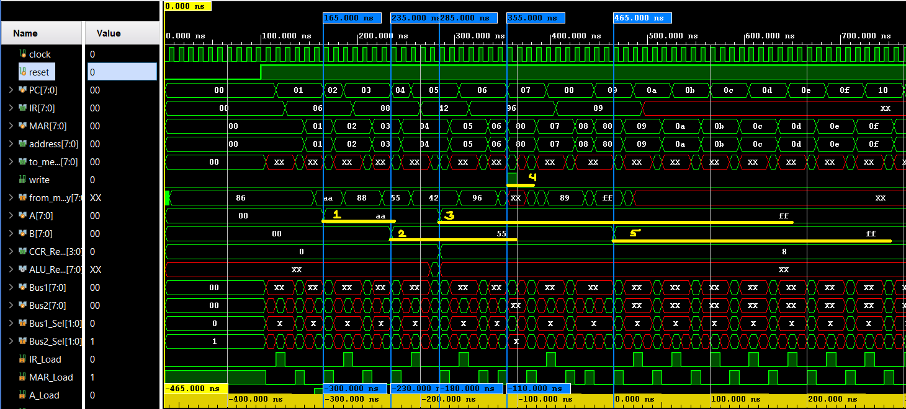

# 8-bit CISC-style processor

This is a behavioral RTL model mimicking a simple CISC-style 8-bit processor.


## Setup (In Vivado)

1. Clone this repo.
2. Open Project in Vivado using **.xpr** file.
3. To run simulation:
   - In **Design Sources**, set the desired module as top by right-clicking in that module.
   - In **Simulation Sources**, there are multiple simulation sets. So, set the particular simulation set as active which contains desired testbench file. 
   - Then, set the desired testbench as top in the active simulation set.
4. Run Behavioral Simulation and see the waveform


## Architecture

  
Fig. Architecture of computer module  

  
Fig. Architecture of CPU module  

   
Fig. Architecture of memory module 


## Instructions

Here, operands are separated from opcode of instructions. So, the instruction size is not fixed.


## Demo Program

Below program is loaded into ROM. And, the output waveform is observed in Vivado Simulator.
```
86 // LDA_IMM
AA // OPERAND
88 // LDB_IMM
55 // OPERAND
42 // ADD_AB
96 // STA_DIR
80 // OPERAND
89 // LDB_DIR
80 // OPERAND
```

### Waveform



### Observations
Let us simplify our observation in 5 particular timestamps.

1. 1st timestamp at 165 ns:   
    **0xAA** is loaded into A register

2. 2nd timestamp at 235 ns:     
    **0x55** is loaded into B register

3. 3rd timestamp at 285 ns:     
    Result of A+B i.e. **0xff** is loaded into A register  

4. 4th timestamp at 355 ns:     
    Value of A register is stored at memory address **0x80** in RW memory

5. 5th timestamp at 465 ns:     
    Value stored at **0x80** is loaded into B register

## References

[Quick Start Guide to Verilog](https://link.springer.com/book/10.1007/978-3-030-10552-5) by ***Brock J. LaMeres***